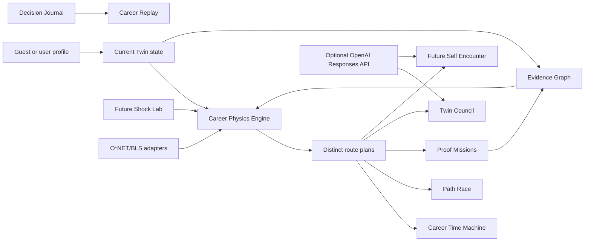

# CareerTwin OS Architecture

## Layers

1. Structured data: demo profile, roles, skills, evidence, constraints, and preferences.
2. Deterministic engine: readiness, route ranking, shocks, seeded uncertainty, and proof missions.
3. Interfaces: Overview, Time Machine, Path Race, Evidence Graph, Missions, Future Self, Decisions, Profile, and Replay.
4. Optional services: Netlify Functions for AI and market enrichment.

## Data flow

The browser starts with a fictional demo twin and local occupation catalog. User constraints and Future Shock toggles recalculate route scores immediately. Evidence labels are derived from support count and claim type. The mission generator produces acceptance criteria and a Codex build brief. Optional AI and market functions add interpretation only when server-side credentials exist.

## Fallback model

The fallback is deterministic and meaningful. It does not return lorem ipsum or fake live AI status. The UI labels the mode as Local Simulation Mode unless the server function reports AI-enhanced output.
