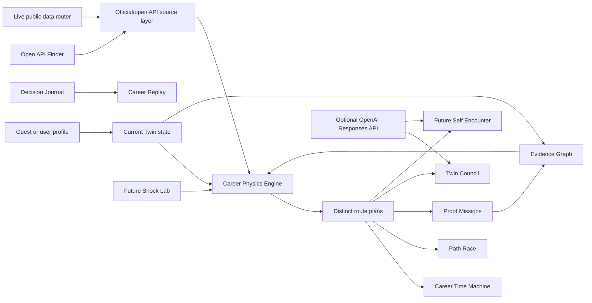

# CareerTwin OS Architecture

## Layers

1. Structured data: demo profile, roles, skills, evidence, constraints, and preferences.
2. Deterministic engine: readiness, route ranking, shocks, seeded uncertainty, and proof missions.
3. Interfaces: Overview, Time Machine, Path Race, Evidence Graph, API Finder, Missions, Future Self, Decisions, Profile, and Replay.
4. Public API discovery: curated source catalog for official/open APIs, key requirements, integration mode, limitations, and disallowed use cases.
5. Live services: Netlify Functions for public market enrichment and optional OpenAI interpretation.

## Data flow

The browser starts with a fictional demo twin and local occupation catalog. User constraints and Future Shock toggles recalculate route scores immediately. Evidence labels are derived from support count and claim type. The mission generator produces acceptance criteria and a Codex build brief. `/api/market` enriches the current route with public GitHub, OpenAlex, World Bank, and Data.gov signals without private credentials. `/api/ai` uses the same public-data router when no OpenAI key is configured, then upgrades to the OpenAI Responses API only when the server-side key exists.

The Open API Finder is a curated discovery layer, not a scraper. It maps source candidates to career use cases and explicitly excludes private job-platform scraping, auto-apply workflows, and unsupported outcome guarantees.

## Resilience model

The deterministic engine remains available when a public source times out, but the production status is no longer a credential-gated local-only mode. The UI labels the runtime as Live Public Data Mode, Public Data Partial Mode, or Public Data Router based on `/api/market` response evidence.
